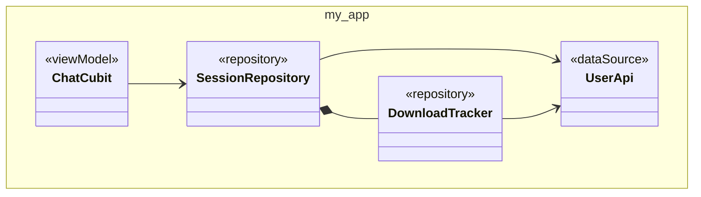

# 😇 Good Intentions

![Coverage][coverage_badge]

Progressively validate and visualize your architecture as your project grows. Good intentions builds off [intentions] to enforce "correct" architecture decisions throughout your project.

Add `good_intentions` as a dev dependency alongside `intentions` (the
annotations). Then run `dart run build_runner build`. You'll get:

- 🖼️ **`lib/architecture.g.puml`** — a PlantUML class diagram of your annotated
  architecture, with violations drawn in red.
- 💻 **Console output** — architecture validation warnings and errors.

## 📦 Installation

```yaml
# pubspec.yaml
dependencies:
  intentions: ...

dev_dependencies:
  build_runner: ...
  good_intentions: ...
```

> [!TIP]
> `good_intentions` is a `build_runner` utility, but you don't need a `build.yaml` file in your project. It will execute whenever you run `dart run build_runner build`.

## 🤖 Why

AI, essentially.

Good intentions allows you to express your intentions as a developer about how a class should be used. Most general purpose programming languages, like Dart, do not encode a developer's intention into source files. A `class` can exist for many different purposes: it could be a view, a view model, a data source, a service, a repository, or any other construct. Even when prompted well, robots  tend to confuse and conflate domain objects with data layer objects.

Good intentions enables automatic architectural enforcement by validating how you intend classes to fit together and issuing errors. This prevents our robot friends from mangling up our code and making a mess of layered architecture.

## 🏛️ Architecture 101

Layered architecture for most CRUD (create, read, update, delete) apps will appear in a variety of variations, but almost always groups layers into three broad categories:

- Presentation
- Domain
- Data

Those categories are generally too broad to be useful, though. It's easier to think of it as about 5 or so different layers that each belong to one of the above groups:

- Presentation
  - **1. View layer**
    - Compose other views
    - Host dependencies via providers
    - Respond to view model changes
  - **2. View model layer**
    - View-related business logic
    - Compose use cases (or repositories, if no use cases exist)
  - Models
- Domain
  - **3. Use case layer**
    - Compose repositories for shared business logic between view models
  - **4. Repositories**
    - Non-view related business logic operations
    - Compose data sources and transform data
  - Models
- **5. Data layer**
  - Compose external packages or standard library operations
  - Move data around
  - Models

## 🍰 Layers

Intentions makes use of these 5 architectural layers:

| Annotation    | Role                                                  |
|---------------|-------------------------------------------------------|
| `@view`       | UI components that render state                       |
| `@viewModel`  | Presentation logic (cubits, blocs, etc)               |
| `@useCase`    | Business orchestration across repositories            |
| `@repository` | Domain data gateways that own bounded contexts        |
| `@dataSource` | Adapters for external systems (Api's, Databases, i/o) |
| `@model`      | Stores data or provides utility for any of the layers |

> [!CAUTION]
> Each class in your project must be annotated with one of the annotations above. Local packages included via `path` which also use the [intentions] package must also be fully annotated. Other dependencies which are remote or do not use the intentions package are not validated.

## ❌ Validation

- Dependencies must flow **downward**. A class annotated with `@repository` can depend on one annotated with `@dataSource`, but not the other way around. A data source which depends on a repository is always a build error.
- Sibling dependencies are always build errors. Two repositories cannot depend on each other.

> [!TIP]
> A class depends on another class if (and only if) that class appears in any of its constructor signatures or fields.

## 📈 Progressive Validation

Good intentions enables "progressive validation" — that is, it will not stop builds if a you skip layers when there are *no* layers.

> [!TIP]
> Instead of immediately enforcing every architectural layer boundary, good intentions *tightens enforcement as the codebase matures*. Higher layers can reach down to lower layers until something in-between actually wraps that dependency. Once wrapped, classes now have to go through the wrapper.

Good intentions figures out which classes are "claimed":

- When a higher-layer class depends on a lower-layer class, the lower class
becomes "claimed" by that layer
- Once a class is claimed, only the claiming layer can access it directly — everything else gets an error

## 🚂 Models

Models (and similarly, utility classes) are generally valid when referenced by multiple layers. The `@model` annotation enables a class to be depended upon by any layer, exempting them from layer rule enforcement.

```dart
@model
class User {
  const User({required this.name, required this.email});
  final String name;
  final String email;
}
```

## 🪓 Hacks

During migrations or early prototyping, you may have classes whose role isn't
clear. Mark them `@hack` and all dependencies involving them produce warnings
instead of errors:

```dart
@hack
class LegacyBridge {
  // TODO: figure out if this is a repository or data source
}
```

## 🤓 Composing Systems via `@PartOf`

Large classes often compose multiple helper classes to enable better modularity and testability. For example, a repository might split its logic into a state machine, a download tracker, and a retry manager. These helpers are all essentially implementation details: they belong to the parent class and shouldn't be accessed by anyone else outside of tests.

```dart
@repository
class SessionRepository {
  const SessionRepository(this.tracker);
  final DownloadTracker tracker;
}

@PartOf(SessionRepository)
class DownloadTracker {
  // Only used by SessionRepository -- essentially part of it :)
}
```

If another class tries to depend on `DownloadTracker` directly, they'll get an error.

> [!TIP]
> Classes annotated with `@PartOf(OwningType)` inherit the owning type's layer.

Multiple `@PartOf` children of the same owner can depend on each other freely.

```dart
@PartOf(SessionRepository)
class DownloadService {
  const DownloadService(this.tracker);
  final DownloadTracker tracker;  // also @PartOf(SessionRepository)
}
```

Internal implementation classes marked are free to make a tangled mess out of themselves. Architecture validation is only concerned with catching the big sins that happen at the seams.

## ⛓️‍💥 Chained `@PartOf`

`@PartOf` can chain: if `Inner` is `@PartOf(Helper)` and `Helper` is
`@PartOf(Repository)`, then `Inner` inherits `Repository`'s layer.

## 🧖‍♀️ Relaxing Usage

Sometimes a class is both a cross-cutting data type *and* logically owned by a
specific parent. State machine states and similar patterns commonly fit this use case:

```dart
@model
@PartOf(SessionRepository)
class SessionState {
  // Logically belongs to SessionRepository, but view models need to
  // read it to display download progress, installation status, etc.
}
```

The `@model` annotation takes precedence for validation — any layer can depend
on `SessionState`. The `@PartOf` relationship will cause the generated diagram to nest `SessionState` inside `SessionRepository`.

## 🫥 Unannotated Classes

Good intentions warns about public, concrete classes that have no intention annotation. Abstract classes, interface classes, and private classes are
ignored.

## 🖼️ Visualizing Your Architecture

Good intentions generates a PlantUML diagram at `lib/architecture.g.puml`.

- Classes are grouped by their annotation (with `<< layer >>` labels)
- `@PartOf` relationships are rendered with composition lines
- Dependency arrows between classes
- **Red arrows** for error-level violations

Models and classes without connections are omitted to keep diagrams clean.

Example output:



[coverage_badge]: good_intentions/coverage_badge.svg
[intentions]: https://pub.dev/packages/intentions
